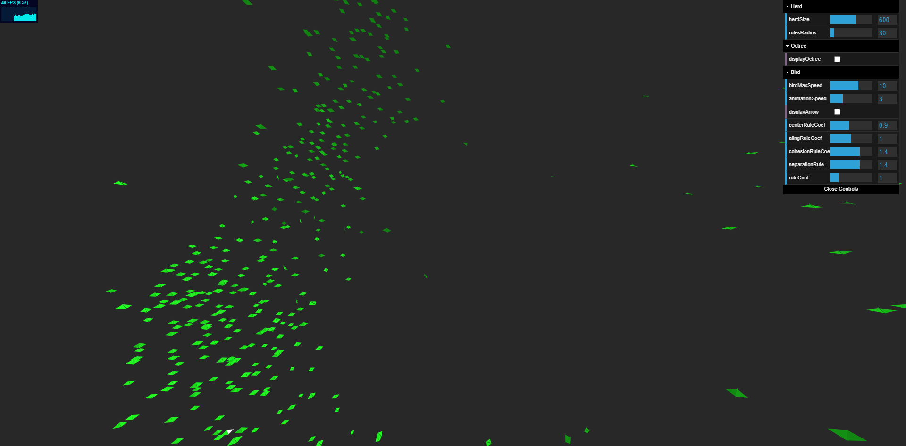

# Animation Experimentation
Experimentation to add animated background to my website

## Experiments
 - [Perlin Noise Experimantion](./0_Perlin_Noise/)

 - [Boids Experimantion](./1_Boids/) 



More to com, See [TODO](./TODO)

---

## Run it

To run it, just clone the repo, then do:
```
$ npm start
```
then go to http://localhost:5000

---
## Acknowledgments
 Great Thanks to :
 - [josephg](https://github.com/josephg) for the [Perlin noise](https://github.com/josephg/noisejs) implementation
 - [Monty Thibault](https://github.com/MontyThibault) for the [Octree/Quadtree](https://gist.github.com/MontyThibault/5000259) implementation for ThreeJS
